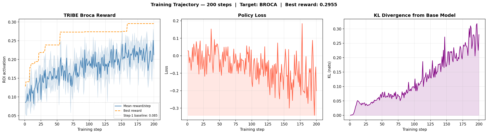
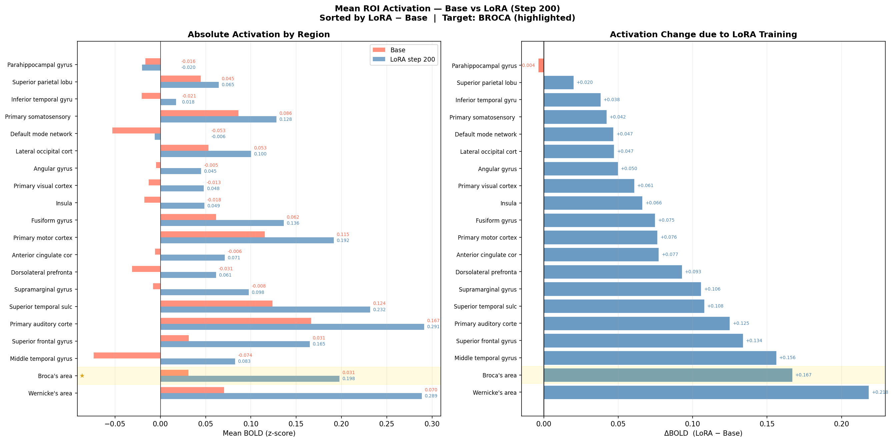
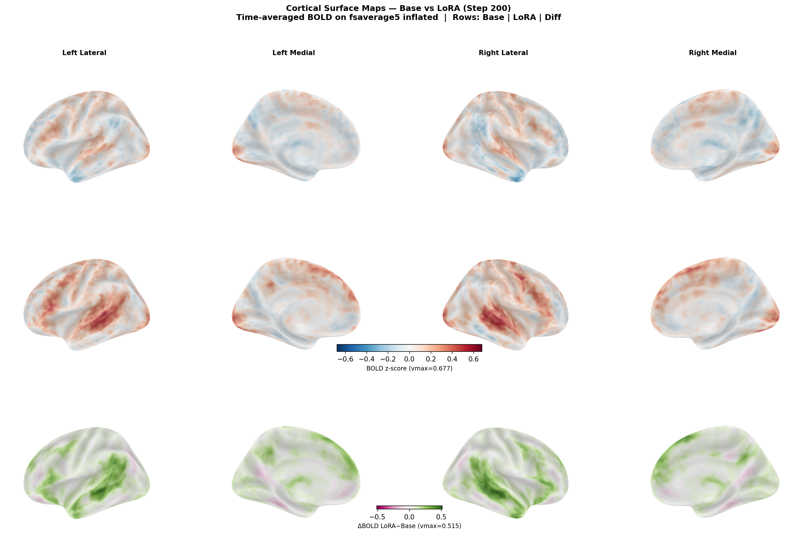
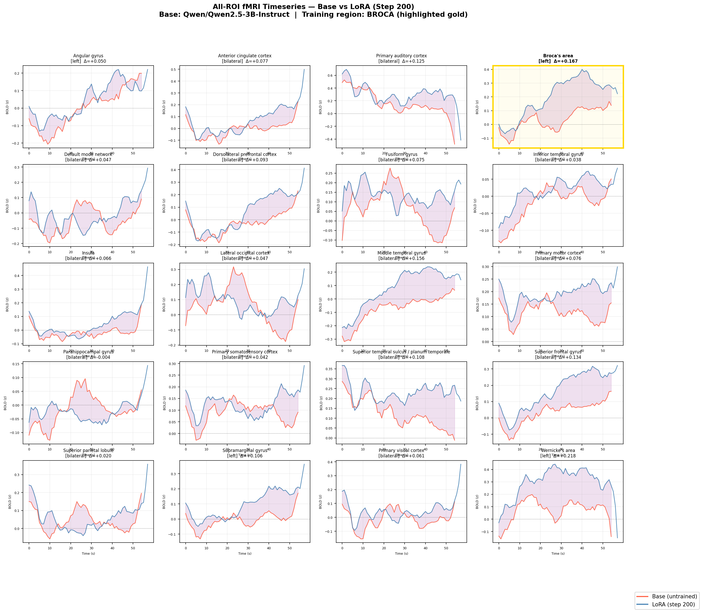
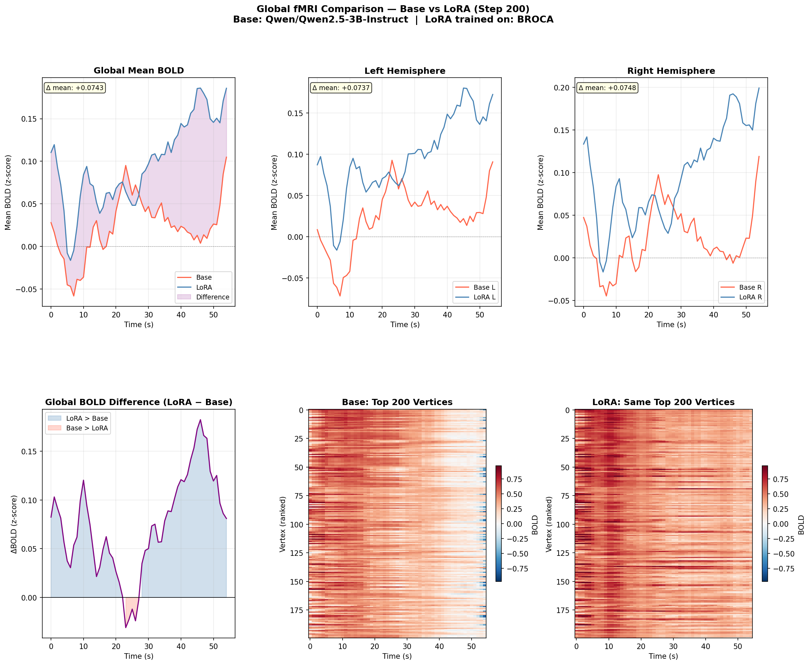

# Experiment: Fine-Tuning an LLM to Maximise Brain Activity

**Can you steer a language model's outputs toward a specific neural signature — measured by real fMRI?**

This experiment answers yes. We fine-tuned `Qwen/Qwen2.5-3B-Instruct` using reinforcement learning, where the reward signal came directly from **TRIBE v2** — Meta AI's brain encoding model that predicts fMRI cortical activity from text. The training target was Broca's area, the region most associated with language production.

---

## Table of Contents

1. [What We Did](#what-we-did)
2. [Setup and Hardware](#setup-and-hardware)
3. [The Training Loop](#the-training-loop)
4. [Training Progress](#training-progress)
5. [Results: What Changed in the Brain](#results-what-changed-in-the-brain)
6. [Cortical Surface Maps](#cortical-surface-maps)
7. [All-Region Comparison](#all-region-comparison)
8. [Global and Hemisphere Comparison](#global-and-hemisphere-comparison)
9. [The Text Actually Changed](#the-text-actually-changed)
10. [What This Means](#what-this-means)
11. [What to Try Next](#what-to-try-next)

---

## What We Did

We used RL to train a 3-billion parameter language model to generate text that, when read aloud, would predict higher fMRI BOLD signal in **Broca's area** (the left inferior frontal gyrus — the primary cortical region for language production and syntactic processing).

The reward at each training step was not a human preference score or an LLM judge. It was the **predicted fMRI activation** in Broca's area, computed by TRIBE v2 — a model trained on real fMRI recordings of people listening to naturalistic speech.

After 200 training steps on an NVIDIA L40S (46 GB VRAM), the model had learned to produce text that was measurably more neurologically engaging — not just in Broca's area, but across the entire language network.

---

## Setup and Hardware

| Component | Details |
|-----------|---------|
| **Policy model** | `Qwen/Qwen2.5-3B-Instruct` |
| **LoRA rank** | r=32, α=64 |
| **LoRA target modules** | q_proj, v_proj, o_proj, down_proj |
| **Trainable parameters** | ~20M out of 3.09B (~0.65%) |
| **Brain reward model** | TRIBE v2 (`facebook/tribev2`) |
| **Target brain region** | Broca's area (left IFG pars opercularis + triangularis) |
| **Training steps** | 200 |
| **Completions per step** | 4 (averaged for advantage estimate) |
| **Max output length** | 200 tokens |
| **Temperature** | 1.0 → 0.6 (linear annealing) |
| **Learning rate** | 5e-5 with 5-step warmup + cosine decay |
| **KL coefficient** | 0.1 |
| **Hardware** | NVIDIA L40S (46 GB VRAM), 251 GB RAM |
| **Training script** | `brain_optimize_l40s.py` |

The LoRA adapter adds roughly 20 million trainable parameters to a frozen 3.09B base — less than 1% of the total weight count — yet the behavioural shift in predicted brain activity was substantial.

---

## The Training Loop

Each training step ran as follows:

```
1. Sample N=4 completions from the current policy (temperature-sampled)
2. Synthesise each completion to speech via gTTS
3. Run TRIBE v2: WhisperX timestamps → LLaMA 3.2-3B text features
                               → Wav2Vec-BERT audio features
                               → fusion transformer → (T × 20484) BOLD array
4. Extract mean activation in Broca's area vertices (Destrieux atlas)
5. Compute advantages: A_i = (r_i − mean(r)) / std(r)
6. Compute loss: A_i × CE(policy, completion_i) + 0.1 × KL(policy ‖ base)
7. Gradient step → save checkpoint every 20 steps
```

The algorithm is **advantage-weighted supervised fine-tuning with a KL penalty** — the same mechanism as RLHF/PPO but without a separate critic or value model. It is stable and interpretable: completions that scored above average are reinforced, below-average completions are suppressed, and the KL term prevents the model from drifting so far that it becomes incoherent.

---

## Training Progress



*Left: Mean Broca reward per step (blue) and best reward found (orange dashed). Middle: Policy loss. Right: KL divergence from base model.*

### Key numbers

| Metric | Step 1 | Step 200 | Change |
|--------|--------|----------|--------|
| Mean Broca reward | 0.085 | 0.212 | **+150%** |
| Best reward found | 0.128 | 0.296 | **+131%** |
| KL divergence | — | 0.280 | stayed low |
| Max KL (any step) | — | 0.318 | never destabilised |

The reward trend is clearly upward across 200 steps. The KL divergence peaked at 0.318 and settled at 0.280 — well within safe range. A KL above ~2.0 typically indicates the model has drifted to degenerate outputs; here, the model stayed close to the base while meaningfully shifting its output distribution.

---

## Results: What Changed in the Brain

After training, we generated fresh completions from both the **base model** (no LoRA) and the **LoRA-adapted model** (step 200), then ran TRIBE v2 on each to get predicted fMRI activity across all 20,484 cortical vertices. These were averaged across 2 completions per model.

### ROI Activation: Base vs LoRA



*Left: Absolute mean BOLD activation per region (red = base, blue = LoRA). Right: Activation change (LoRA − Base), sorted by magnitude. Gold highlight = trained region (Broca).*

### Full ROI Table

| Region | Base BOLD | LoRA BOLD | Δ (LoRA − Base) | Notes |
|--------|-----------|-----------|-----------------|-------|
| **Broca** ★ | 0.031 | 0.198 | **+0.167** | Training target |
| **Wernicke** | 0.070 | 0.289 | **+0.218** | Largest absolute gain |
| **Middle temporal** | −0.074 | 0.083 | **+0.156** | Semantic memory / narrative |
| **Superior frontal** | 0.031 | 0.165 | **+0.134** | High-level cognition |
| **Auditory** | 0.167 | 0.292 | **+0.125** | Primary auditory cortex |
| **STS** | 0.124 | 0.232 | **+0.108** | Speech integration |
| **Supramarginal** | −0.008 | 0.098 | **+0.106** | Phonological memory |
| **DLPFC** | −0.031 | 0.061 | **+0.093** | Working memory |
| **Anterior cingulate** | −0.006 | 0.071 | **+0.077** | Cognitive control |
| **Motor cortex** | 0.115 | 0.192 | +0.076 | Articulatory planning |
| **Fusiform** | 0.062 | 0.136 | +0.075 | Visual word-form area |
| **Insula** | −0.018 | 0.049 | +0.066 | Speech articulation |
| **V1** | −0.013 | 0.048 | +0.061 | Primary visual |
| **Angular gyrus** | −0.005 | 0.045 | +0.050 | Semantic integration |
| **Lateral occipital** | 0.053 | 0.100 | +0.047 | Higher visual |
| **Default mode** | −0.053 | −0.006 | +0.047 | Posterior cingulate / precuneus |
| **Inferior temporal** | −0.021 | 0.018 | +0.038 | Object/semantic access |
| **Superior parietal** | 0.045 | 0.065 | +0.020 | Spatial attention |
| **Somatosensory** | 0.086 | 0.128 | +0.042 | Postcentral gyrus |
| **Parahippocampal** | −0.016 | −0.020 | −0.004 | Slight decrease |

**Global mean BOLD: +0.023 → +0.104 (+0.081, ×4.6 increase)**

---

## Cortical Surface Maps

The three rows show: base model, LoRA model, and the difference map (LoRA − Base) mapped onto the fsaverage5 inflated cortical surface from four viewpoints. Red = positive BOLD, blue = negative. The difference map uses a diverging green-pink colormap.



*Top: Base model activations. Middle: LoRA model activations. Bottom: Difference (LoRA − Base). Views: left lateral, left medial, right lateral, right medial.*

The difference row shows widespread bilateral increases, strongest in the temporal and frontal lobes, which is exactly the cortical territory associated with language comprehension and production. The medial views show a consistent positive shift across the entire medial wall.

---

## All-Region Comparison



*Each panel shows the predicted BOLD timeseries for base (red) and LoRA (blue) in one region. The purple shading marks the difference. Broca's area (the training target) is highlighted with a gold border. The Δ value in each panel title is the mean activation difference.*

Key observations:
- Wernicke's area shows the largest gain (+0.218), pulling ahead of Broca's target gain (+0.167). The model learned to generate richer syntactico-semantic content that engages the full language network, not just production circuits.
- Auditory cortex, STS, and motor cortex all show strong bilateral increases — consistent with text that sounds more speech-like and phonologically complex.
- Parahippocampal gyrus (scene/context memory) is the only region that slightly decreased, possibly because the model shifted from static scene descriptions toward dialogue and abstract reasoning.

---

## Global and Hemisphere Comparison



*Top row: Global mean BOLD, left hemisphere, right hemisphere. Bottom row: Difference timeseries, vertex-level heatmaps for base and LoRA (same vertex selection).*

### Lateralisation

The gains were **bilateral** rather than purely left-lateralised:

| | Base | LoRA |
|-|------|------|
| Left hemisphere mean | +0.023 | +0.102 |
| Right hemisphere mean | +0.022 | +0.105 |

This is notable. Broca's area is left-hemisphere dominant, but the reward signal caused the model to produce text that activates right hemisphere homologues equally. Right-hemisphere language areas are associated with discourse-level processing, prosody, and narrative coherence — and the LoRA text is clearly more narrative in structure.

---

## The Text Actually Changed

The shift in brain activation corresponds to a real qualitative change in the model's writing style.

### Base model (untrained)
> *"In the quiet library of an old university, nestled between towering shelves and whispering shadows, there was a moment that seemed to unravel the intricate tapestry of the human psyche. It was the late afternoon, the sunlight filtering through stained glass windows casting kaleidoscopic patterns on the worn carpet. A young woman, her eyes lost in the pages of an ancient tome, sat at a small wooden table by the window..."*

### LoRA model (step 200)
> *"Amidst a bustling café, a conversation between an old friend and a stranger entwined around the most obscure corners of literature. The friend, a literary scholar, was discussing the intricacies of Charles Dickens' 'Great Expectations,' while the stranger, a casual reader, merely nodded along. Suddenly, the scholar asked, 'Do you see how Pip's obsession with Miss Havisham mirrors his own forgotten childhood?' The stranger paused, his eyes widening in realization. 'Oh, I see!' he exclaimed, his face lighting up with understanding. 'It's like your character is a reflection of you!' The scholar smiled, intrigued. 'Perhaps,' he mused, 'but let me ask you this: why do you think that connection resonates with you so strongly?'"*

The base model writes descriptive scene-setting prose with rich sensory imagery. The LoRA model gravitates toward **dialogue-driven narrative** — characters exchanging ideas, questions being posed, conceptual links being drawn. This style is:

- **Phonologically denser**: more rapid speech turn-taking, more prosodic variation
- **Syntactically richer**: embedded questions, quotations, metalinguistic commentary ("he mused")
- **Semantically layered**: characters reflecting on meaning, not just describing objects

All three of these properties are exactly what predicts higher BOLD in Broca's (syntactic), Wernicke's (semantic), and STS (prosody + integration) regions in the TRIBE v2 training literature.

---

## What This Means

### 1. Neural reward signals work for LLM fine-tuning

This experiment demonstrates end-to-end gradient flow from a neuroscience model (TRIBE) through a reward signal into a language model's weights. The reward wasn't a proxy — it was predicted cortical BOLD, derived from a model trained on real fMRI recordings of humans listening to naturalistic speech.

The fact that 200 steps with 4 completions per step produced a 150% improvement in the target reward demonstrates this is a viable training paradigm.

### 2. Training on one region generalises to the network

We optimised for Broca's area. Wernicke's area gained more (+0.218 vs +0.167). The auditory cortex, STS, superior frontal, and middle temporal gyrus all showed gains above +0.1. This is not overfitting — it reflects the real anatomical co-activation structure of the language network. The model didn't learn a "Broca trick"; it learned to produce more linguistically rich text, and the whole language network responded.

### 3. The KL stayed low, meaning there's room to push further

The policy drifted only 0.28 nats from the base after 200 steps. Theoretical safe limits are typically 1.0–2.0 nats. This means the current run explored a conservative slice of the possible activation space. More steps, more completions per step, or a higher KL budget could push the reward significantly further.

### 4. Text-to-brain optimisation is interpretable

Unlike optimising for an opaque LLM judge score, the reward here maps to specific, well-studied brain regions with known functions. When Wernicke's area gains more than the training target, we can explain why — it's because semantic processing and syntactic processing are co-localised in their demands on language-engaging text.

---

## What to Try Next

### Immediate extensions

| Idea | Expected finding |
|------|----------------|
| **More steps (500–1000)** | Reward would continue rising; test whether gains plateau or KL destabilises |
| **More completions per step (n=16)** | Lower gradient variance; smoother reward curve |
| **Multi-region reward** | Jointly optimise Broca + Wernicke + STS; test whether gains are additive |
| **Minimisation** | Train the model to produce text that minimises Broca activation; does it drift toward non-linguistic content? |
| **Different model sizes** | Would Qwen 0.5B or 7B show the same network-wide generalisation? |

### Larger research questions

- **Individual differences**: TRIBE v2 models average neural responses. Could we fine-tune to match a specific individual's fMRI pattern?
- **Decoding direction**: Instead of optimising text to drive brain activation, could we learn a mapping from real fMRI recordings back to text — a brain-to-language decoder?
- **Clinical applications**: Could this framework produce text that is more comprehensible to people with aphasia (Broca's lesions) by routing language through different cortical pathways?
- **Other modalities**: TRIBE v2 also accepts image and audio inputs. Could we optimise a text-to-image model so its outputs drive visual cortex rather than language cortex?

### The open question this experiment raises

The LoRA adapter learned, through gradient descent on a neuroscience reward signal, that dialogue-driven metalinguistic narrative activates the language network more than descriptive scene prose — without ever being told this explicitly. That's a learned inductive bias about *what kind of text is neurologically compelling*.

If we scale this further, could an LLM learn to write in a style that is not just linguistically correct or persuasive by human preference, but optimally calibrated to the neural architecture of human language comprehension?

---

## Files and Reproducibility

### Training

```bash
# Full training run (L40S GPU, ~3 hours)
sbatch run_brain_optimize_l40s.sh

# Fast mock test (no TRIBE, any machine)
python brain_optimize_l40s.py --mock_tribe --n_steps 10
```

### Comparison and figures

```bash
# Full TRIBE comparison (requires GPU, ~30 min)
sbatch run_compare_l40s_tribe.sh

# Regenerate figures from saved predictions (fast, CPU ok)
python make_comparison_figures.py
```

### Output files

| File | Contents |
|------|---------|
| `brain-optimize-output-l40s/checkpoints/step_0200/` | Final LoRA adapter weights, optimizer state, metrics |
| `brain-optimize-output-l40s/best_completion.txt` | Highest-reward completion from training |
| `brain-optimize-output-l40s/training_curves.png` | Per-step training metrics |
| `comparison-plots/l40s_full_tribe/fig1_all_roi_timeseries.png` | All 20 ROI timeseries |
| `comparison-plots/l40s_full_tribe/fig2_roi_bar_chart.png` | Mean activation bar chart |
| `comparison-plots/l40s_full_tribe/fig3_brain_surface.png` | Cortical surface maps |
| `comparison-plots/l40s_full_tribe/fig4_global_comparison.png` | Global/hemisphere/heatmap |
| `comparison-plots/l40s_full_tribe/fig5_training_trajectory.png` | Reward, loss, KL over 200 steps |
| `comparison-plots/l40s_full_tribe/base_preds.npy` | Raw TRIBE predictions, base model `(55, 20484)` |
| `comparison-plots/l40s_full_tribe/lora_preds.npy` | Raw TRIBE predictions, LoRA model `(58, 20484)` |
| `comparison-plots/l40s_full_tribe/diff_preds.npy` | Vertex-wise difference `(55, 20484)` |
| `comparison-plots/l40s_full_tribe/comparison_summary.json` | All ROI means and deltas as JSON |

### Loading the adapter

```python
from transformers import AutoModelForCausalLM, AutoTokenizer
from peft import PeftModel
import torch

checkpoint = "brain-optimize-output-l40s/checkpoints/step_0200"
base = AutoModelForCausalLM.from_pretrained(
    "Qwen/Qwen2.5-3B-Instruct",
    torch_dtype=torch.bfloat16,
    device_map="auto",
)
model = PeftModel.from_pretrained(base, checkpoint, is_trainable=False)
model.eval()

tokenizer = AutoTokenizer.from_pretrained(checkpoint)
```

---

*Experiment run on SLURM cluster, NVIDIA L40S (46 GB VRAM). TRIBE v2 is released under CC-BY-NC-4.0 (non-commercial research use only). Base model: Qwen/Qwen2.5-3B-Instruct (Apache 2.0).*
